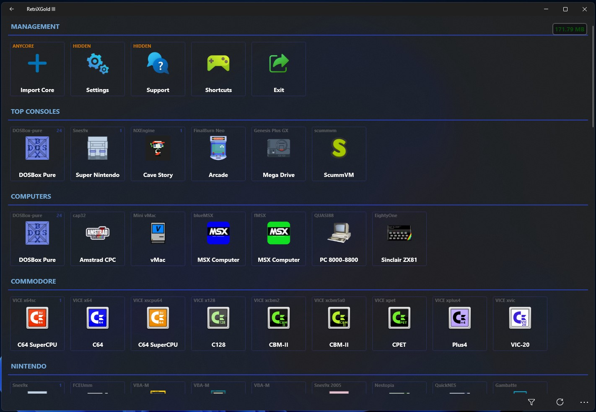

   
  <b>UWP Games Emulator, Libretro Frontend originally by Alberto Fustinoni</b> 
  <a href="./src">Source</a> |
  <a href="https://github.com/Aftnet/RetriX">Original Project</a> 
    
    

# Important

You are <b>not allowed</b> to:

- Sell this app or any of it's components, it should be free

- Not to be part of any commercial action

- No tracking or analytics should be added, The project built with privacy respect

# Features (Gold Edition)

- Dynamic cores (dll) loader

- Upgradable cores

- Cores options (available in-game also) 

- Extended emulation systems

- Advanced games list

- Games history with total play time

- Customizable controls

- Customizable Touch pad

- Touch pad auto profile (Based on system)

- Able to accept new cores (AnyCore feature)

- Backup/Restore feature

- Improved touch pad

- Improved CPU render

- Video Effects

- Audio effects

- Threads render (New Feature)

- Save states manager

- Improved BIOS manager

- Many new options added

- Bugs fixes

### Effects System
  

### Pixels Update
  
	

### Overlay
  
	

# Limitations

The app uses libretro VFS first version

so you have to switch back the core VFS functions if you want to compile it for Retrix

otherwise we need to upgrade the current VFS layer in Retrix

No GPU render available, but the current CPU render provides good performance for many cores

# Target

It will work with build 16299 and above, ARM - x64 - x86

The attached releases already retargeted to support Windows 10 Mobile 1709

If you want to run it on device with lower build, you need to customize the package <b>MSIX Packaging tool</b>

it might work fine without any problems.

# Credits

Developed by Alberto Fustinoni

RetrixGold Developement by Bashar Astifan

Render solution DekuDesu

