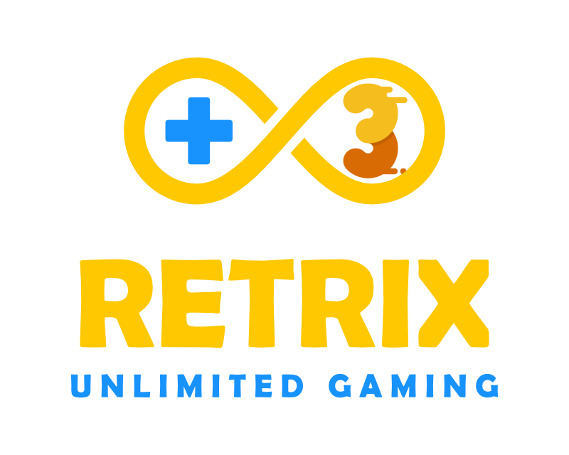

   
  <b>Universal Libretro Frontend</b> 
  <a href="./src">Source</a> |
  <a href="https://github.com/Aftnet/RetriX">Original Project</a> 
    
    

Get it from itch.io

App notice:

- This app provided for free without any warranty

- You cannot sell this app or any of it's components, it should be free

- Not to be part of any commercial action

- No tracking or analytics should be added at all

# ARM64
- RetrixGold is a libretro frontend
- As long there are no ARM64 cores ready, any ARM64 will be pointless
- For ARM64 please refer to libretro for any update [Click here](https://retroarch.com/?page=platforms)

# Download

- <a href="https://github.com/basharast/RetrixGold/releases/latest">RetriXGold Latest (GitHub) +Cores</a>

- <a href="http://retrix.astifan.online/cores.html">Supported cores</a>

# What's new in RetriXGold 3.0

- New Layouts

- New Libretro VFS layer

- New Cores

- Online cores updater

- Easy BIOS management

- Games lists cache

- Smart roms resolver (with 7z, rar, zip support)

- Support start core without content

- Play statisitics (Internal usage only)

- Major base code changes

- Advanced customization for Gamepad and options

- Onscreen Keyboard

- Custom Saves/System folder (if supported)

- Pre-Configuration for cores with (free to use content)

- Improved & accurate touch functions

- Controllers ports mapping

- URI integration (RetroPass)

- Bugs fixes

- Much more

## Libretro VFS layer (new)?

This means you can use any Libretro core with Retrix directly

the new VFS layer is much smarter and provides compatiblity with archived roms (even if the core doesn't support that)

it can also solve many issues that prevent UWP app from accessing to the content

# Limitations

- [x] HW Render Configuration
- [ ] OpenGL
- [ ] OpenGLES
- [ ] DirectX

### Easy BIOS Import
  

### Effects System
  

# Target

## Desktop & XBOX

It will work with build 17763 and above

## WindowsRT (ARM)

It will support only 15035 build

## Windows Phone (W10M)

The attached releases already retargeted to support Windows 10 Mobile 15063+

# Credits

RetrixGold Developement by Bashar Astifan (Since 2019)

Based on RetriX by <a href="https://github.com/albertofustinoni">Alberto Fustinoni</a> 

# Support

Yo can help me to keep this kind of projects a live by supporting my projects like:

- <a href="https://github.com/basharast/wut">W.U.T</a>

- <a href="https://github.com/basharast/AstifanSystem">Astifan System</a>

# Thanks

The for the following for their support and ideas:

- Khanlend Theinoend
- Dom's & Gamr13
- Danprice142 
- Ranomez
- DekuDesu
