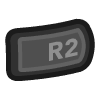

# NEC - PC-FX (Beetle PC-FX)

## Background

Beetle PC-FX is a port of Mednafen PC-FX video game system emulator for the NEC PC-FX.

### Author/License

The Beetle PC-FX core has been authored by

- [Mednafen Team](https://mednafen.github.io/)

The Beetle PC-FX core is licensed under

- [GPLv2](https://github.com/libretro/beetle-pcfx-libretro/blob/master/COPYING)

A summary of the licenses behind RetroArch and its cores can be found [here](../development/licenses.md).

## Extensions

Content that can be loaded by the Beetle PC-FX core have the following file extensions:

- .cue
- .ccd
- .toc
- .chd

## Databases

RetroArch database(s) that are associated with the Beetle PC-FX core:

- [NEC - PC-FX](https://github.com/libretro/libretro-database/blob/master/rdb/NEC%20-%20PC-FX.rdb)

## BIOS

Required or optional firmware files go in the frontend's system directory.

|   Filename    |    Description                           |              md5sum              |
|:-------------:|:----------------------------------------:|:--------------------------------:|
| pcfx.rom      | PC-FX BIOS v1.00 - 2 Sep 1994 - Required | 08e36edbea28a017f79f8d4f7ff9b6d7 |

## Features

Frontend-level settings or features that the Beetle PC-FX core respects.

| Feature           | Supported |
|-------------------|:---------:|
| Restart           | ✔         |
| Screenshots       | ✔         |
| Saves             | ✔         |
| States            | ✔         |
| Rewind            | ✔         |
| Netplay           | ✔         |
| Core Options      | ✔         |
| RetroAchievements | ✔         |
| RetroArch Cheats  | ✕         |
| Native Cheats     | ✕         |
| Controls          | ✔         |
| Remapping         | ✔         |
| Multi-Mouse       | ✕         |
| Rumble            | ✕         |
| Sensors           | ✕         |
| Camera            | ✕         |
| Location          | ✕         |
| Subsystem         | ✕         |
| [Softpatching](../guides/softpatching.md) | ✕         |
| Disk Control      | ✕         |
| Username          | ✕         |
| Language          | ✕         |
| Crop Overscan     | ✔         |
| LEDs              | ✕         |

### Directories

The Beetle PC-FX core's internal core name is 'Beetle PC-FX'

The Beetle PC-FX core saves/loads to/from these directories.

**Frontend's Save directory**

- 'content-name'.srm (Save)

**Frontend's State directory**

- 'content-name-.state# (State)

### Geometry and timing

- The Beetle PC-FX core's core provided FPS is 60
- The Beetle PC-FX core's core provided sample rate is 44100 Hz
- The Beetle PC-FX core's core provided aspect ratio is 4/3

### Loading PC-FX content

Beetle PC-FX needs a cue-sheet that points to an image file. A cue sheet, or cue file, is a metadata file which describes how the tracks of a CD or DVD are laid out.

If you have e.g. `foo.bin`, you should create a text file and save it as `foo.cue`. If you're playing a single-track Saturn game, then the cue file contents should look like this:

`foobin.cue`
```
 FILE "foo.bin" BINARY
  TRACK 01 MODE1/2352
   INDEX 01 00:00:00
```

After that, you can load the `foo.cue` file in RetroArch with the Beetle PC-FX core.

!!! attention
    Certain PC-FX games are multi-track, so their .cue files might be more complicated.

## Core options

The Beetle PC-FX core has the following option(s) that can be tweaked from the core options menu. The default setting is bolded.

Settings with (Restart) means that core has to be closed for the new setting to be applied on next launch.

- **High Dotclock Width (Restart)** [pcfx_high_dotclock_width] (**1024**/256/341)

	Emulated width for 7.16MHz dot-clock mode. Lower values are faster, but will cause some degree of pixel distortion.

- **Suppress Channel Reset Clicks (Restart)** [pcfx_suppress_channel_reset_clicks] (**enabled**/disabled)

	Hack to suppress clicks caused by forced channel resets.

- **Emulate Buggy Codec (Restart)** [pcfx_emulate_buggy_codec] (**disabled**/enabled)

	Hack that emulates the codec a buggy ADPCM encoder used for some games' ADPCM.

- **Sound Quality (Restart)** [pcfx_resamp_quality] (**3**/4/5/0/1/2)

	Higher values correspond to better SNR and better preservation of higher frequencies("brightness"), at the cost of increased computational complexity and a negligible increase in latency.

- **Chroma channel bilinear interpolation  (Restart)** [pcfx_rainbow_chromaip] (**disabled**/enabled)

	Enable bilinear interpolation on the chroma channel of RAINBOW YUV output. Enabling it may cause graphical glitches with some games.

- **No Sprite Limit (Restart)** [pcfx_nospritelimit] (**disabled**/enabled)

	Remove 16-sprites-per-scanline hardware limit.

- **Initial scanline** [pcfx_initial_scanline] ((0 to 40 in increments of 1. **4 is default**.)

	Adjust first display scanline.

- **Last scanline** [pcfx_last_scanline] (208 to 238 in increments of 1. **235 is default**.)

	Adjust last display scanline.

- **Mouse Sensitivity** [pcfx_mouse_sensitivity] (1.00 to 5.00 in increments of 0.25. **1.25 is default**.)

	Configure the sensitivity of the 'PCFX Mouse' device type,

## Controllers

The Beetle PC-FX core supports the following device type(s) in the controls menu, bolded device types are the default for the specified user(s):

### User 1 - 2 device types

- None - Doesn't disable input.
- **PCFX Joypad** - Joypad
- PCFX Mouse - Mouse

### Controller tables

#### Joypad

| User 1 - 6 Remap descriptors | RetroPad Inputs                           |
|------------------------------|-------------------------------------------|
| II                           |     |
| IV                           |     |
| Select                       |      |
| Run                          |       |
| D-Pad Up                     |     |
| D-Pad Down                   |   |
| D-Pad Left                   |   |
| D-Pad Right                  |  |
| I                            |     |
| III                          |     |
| V                            |          |
| VI                           |          |
| MODE 1 (Switch)              |          |
| MODE 2 (Switch)              |          |

#### Mouse

| RetroMouse Inputs                                   | PCFX Mouse              |
|-----------------------------------------------------|-------------------------|
|  Mouse Cursor | PCFX Mouse Cursor       |
|  Mouse 1       | PCFX Mouse Left Button  |
|  Mouse 2      | PCFX Mouse Right Button |

## Compatibility

| Game                                                            | Issue                                                   |
|-----------------------------------------------------------------|---------------------------------------------------------|
|                                                                 |                                                         |

## External Links

- [Official Mednafen Website](https://mednafen.github.io/)
- [Official Mednafen Downloads](https://mednafen.github.io/releases/)
- [Libretro Beetle PC-FX Core info file](https://github.com/libretro/libretro-super/blob/master/dist/info/mednafen_pcfx_libretro.info)
- [Libretro Beetle PC-FX Github Repository](https://github.com/libretro/beetle-pcfx-libretro)
- [Report Libretro Beetle PC-FX Core Issues Here](https://github.com/libretro/beetle-pcfx-libretro/issues)
